 > #   A Beginners Guide to Glasp
 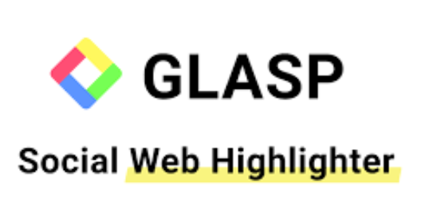

> ## Table of contents

* [Introduction To Glasp](#introduction)

- [What is Glasp?](#what-is-Glasp)

* [Features of Glasp](#features-of-glasp)

- [Installation](#installation)

* [How to use Glasp](#how-to-use-glasp)

- [Conclusion](#conclusion)

> ## Introduction

Glasp is an AI extension that stands for "Greatest Legacy Accumulated as Shared Proof", It is tackling use cases to democratize opportunities for everyone to share and develop their learnings using highlighted information in simple clicks.   __On June 1, 2021, by Kazuki Nakayashiki and Kei Watanabe established the Glasp tool__. Its aim is to prevent the isolation of knowledge. Glasp is available only on desktops.

> ## What is Glasp?

Glasp is a social web highlighting tool that lets you quickly capture online content with colored highlighting options.  With this tool, the highlight can be tagged, linked to, and searched for on other platforms such as Twitter, Facebook, LinkedIn, etc. It is also used to get the summary of a YouTube video with ChatGPT.

> ## Features of Glasp

Glasp has outstanding features some of which it possesses are:

**Highlight text on the web:** With Glasp, key phrases, and topics in social media platforms can be highlighted, this creates an ease for users to quickly identify important information.

**Take notes on saved highlights:** Glasp gives you the leverage to take notes on the highlights being saved for proper understanding.

**Add tags to your highlights:** Glasp identifies and extracts important key phrases and topics from social media posts and assigns takes to them accordingly. This makes it easier for you to quickly understand the most important information on a social media post.

**Discover useful content from like-minded people:** Glasp can affiliate with other tools to monitor conversations related to a particular topic of interest and then use that information to identify users who are also interested in that topic. Identification of these like minds helps the users to interact, and share content and ideas.

**Save what is important to you for future use:** Glasp is designed to help users identify and highlight key phrases and topics in social media conversations in real-time. Glasp allows you to customize the tags and topics that are highlighted. This makes you focus on the information that is important to you.

**Integrating AI Tools:** Glasp has an amazing feature that integrates AI tools such as ChatGPT, Notion, and Obsidian for ease of reading, writing and summarizing.

> ## Installation

Glasp can be added as an extension to all web browsers, The installation procedure used for Chrome can be used for other web browsers, you can add Glasp on your Pc with the following steps:

### How to Install Glasp on Chrome 

**Step One:** open up your web browser, input the link <https://glasp.co/>, on your search engine tab, or click on the link [here](https://glasp.co/), You will be directed to the home page of Glasp.

**Step Two:** Click on the "Install on Chrome" icon in the bottom-left corner of your browser to install Glasp.

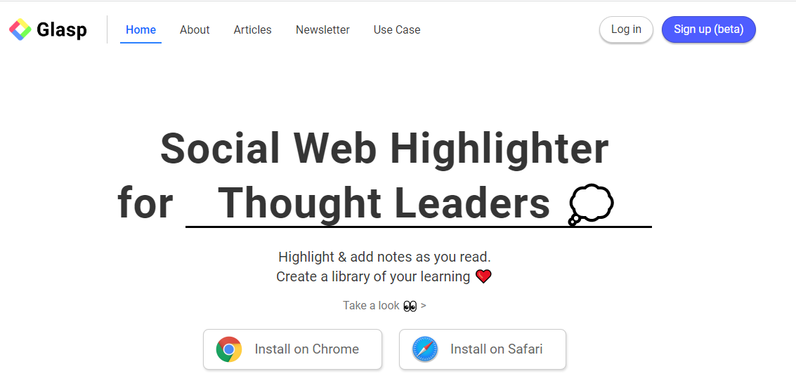

**Step Three:** Click on the "Add to Chrome" tab to install the extension.
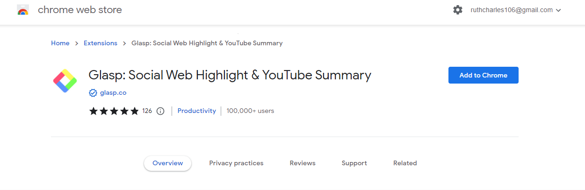

**Step Four:** Click on the "add extension tab to add Glasp as an extension. The browser will download the extension immediately, and you will be directed to its homepage. Pin the extension for efficiency.

### How to Install Glasp on Safari

This installation on Safari is mainly for iOS users. 
To get a detailed procedure on how to install Glasp on your Safari browser, click [here](https://glasp.co).

 #### How To Sign up on Glasp

 Signing up on the Glasp platform gives you unlimited access to the platform, You can sign up by following the steps below: 

**Step One:** Click on "Continue with Google tab" at the right corner of your web browser.
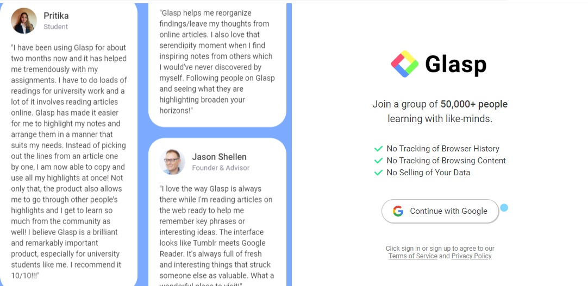

**Step Two:** Tap to choose  your preferred email, the page will reload and you will be directed to your profile. Your account is ready for use.

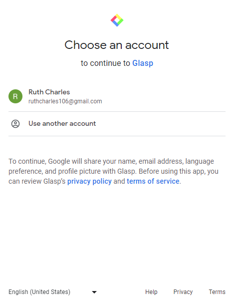

> ## How to Use Glasp

**Set up your Glasp account**
 Setting up your Glasp account gives you an identity and a sense of belonging, You can set up your account by following  the steps below.

**Step One:** Click on  the "My Highlights" tab at the top left corner of your screen.
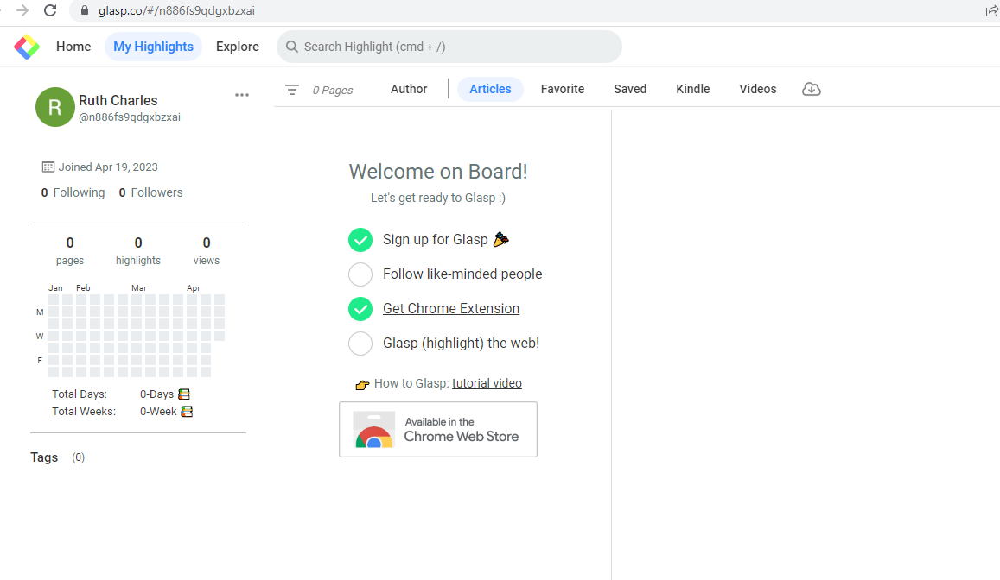

**Step Two:** Click on the three dots to edit your profile.

**Step Three:** input your display name, username, bio, and location, and upload your image. Input links to your preferred social media accounts.
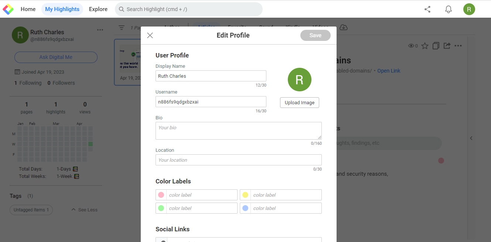

**Step four**: Save your details, and you have successfully added your profile.

**How to Highlight on Glasp**

Highlighting on Glasp can be done with the following steps:

**Step One:** Click on the home tab,
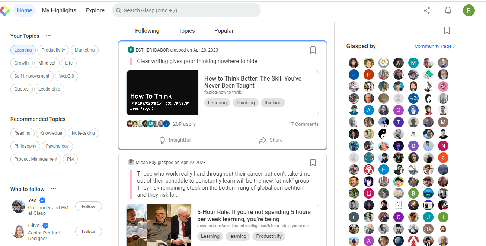

**Step Two:** Select your preferred topic,

**Step Three:** Click on an article of your choice, click on the sentence you want to highlight, stop at where you want the highlight to end,and a pop-up of different colors will emerge on your screen. Select your preferred color to highlight the text.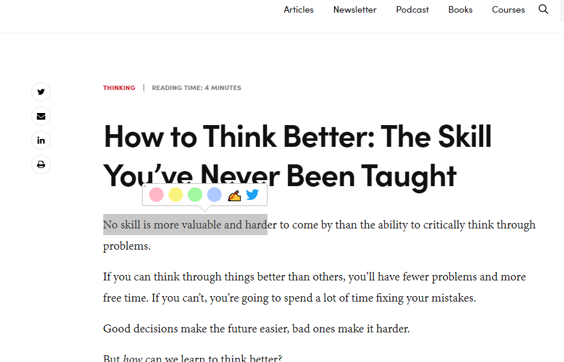

**How to add a note:** Click on the sentence you want to highlight, and you can pick a preferred color. Click on the note icon, and a pop-up will appear on the right hand side of your screen. Add your notes.

**How to save an article:** click on the save icon at the top of your preferred article to save an article you wish to go back to. 

**How to acknowledge an article:** If you find the article insightful, click on the insightful icon, this is a way of giving a thumbs up to the article you read.

**How to share an article:** click on the share icon, then click on your choice of sharing the article.

**How to use Glasp on YouTube**

Glasp, with the help of ChatGPT can be used to transcribe and summarize a YouTube video.

You can do this with the following steps:

**Step One:** Open YouTube in your preferred browser.
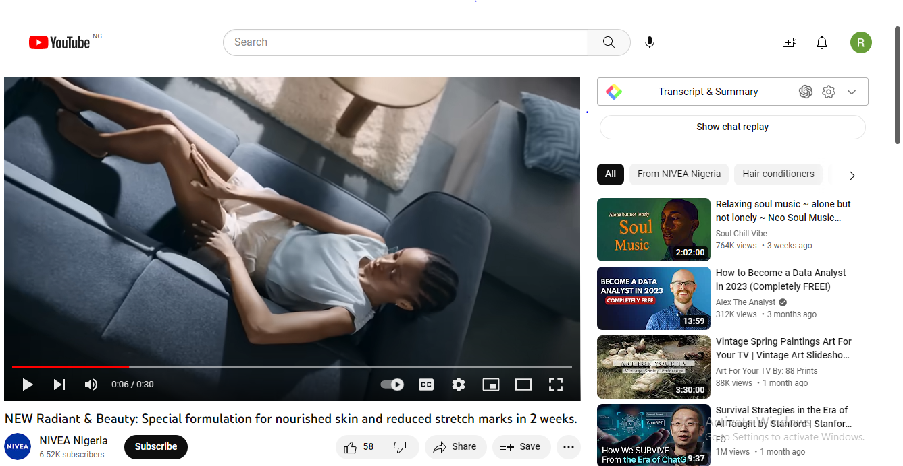

**Step Two:** Click on the video you intend to watch.

**Step Three:** Click on the Glasp icon at the top right corner to highlight important sentences.

**Step Four:** Click on the ChatGPT icon at the top right corner of your browser. You will be directed to the ChatGPT interface. Patiently wait as it summarizes your video.
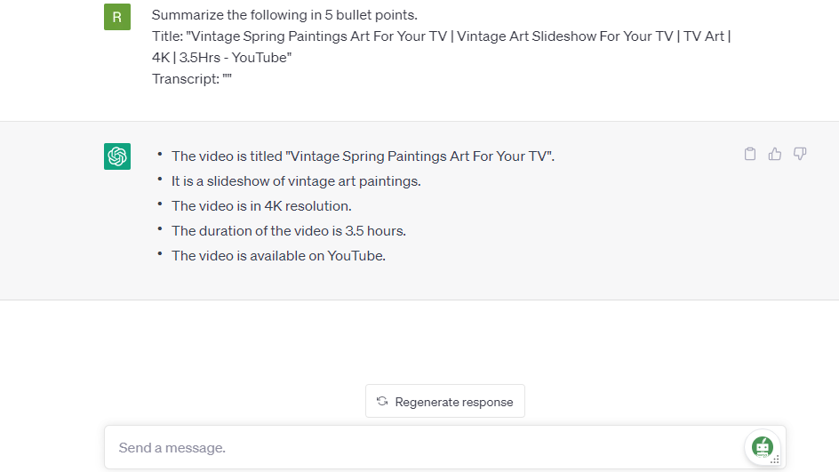

**How to explore more contents:** The explore icon lets you search for more from the search bar. You can search for more content by clicking on your preferred hashtags, authors, or websites.

**How to Search Highlights:** Click on the "Search Highlights" icon to search for highlights.

**How to Invite Friends:** Click on the share icon on the right, copy your code, and share on your preferred social media or as a message to a friend.

**How to check notifications:** Click on the bell to check for recent notifications.

**How to see highlighted articles:** To see your highlighted articles, click on the articles icon.

**How to view favorite highlights:** To view your favorite highlights, click on the favorite icon to see your favorite highlights.

> ## Conclusion

 Glasp encompasses most of the amazing features that could ease the burden of a student, researcher, or reader. You can check the Glasp website [here](https://glasp.co/) for further knowledge about the app.

__References__

*crunch base* - https://www.crunchbase.com/organization/glasp

